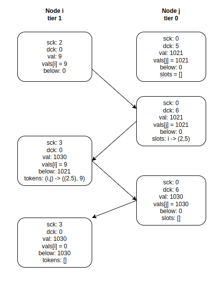
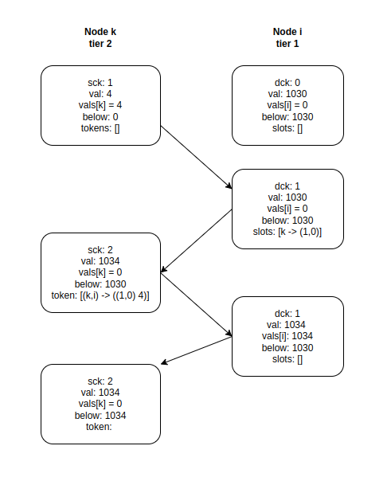

# Handoff Counters

This is yet another implementation for the Handoff Counters presented in the paper [Scalable Eventually Consistent Counters over Unreliable Networks](https://arxiv.org/abs/1307.3207). 
The official implementation can be found in [this](https://github.com/pssalmeida/handoff_counter-rs) repository. 

## Example 1

Consider the following example, where `node i` sends its information to a `node j` in a lower tier. 

    

## Example 2 
The [second example](./tests/merge.rs) tests the `merge` of states. The calls the following functions in sequence:

- fillslots
- discardslot
- createslot
- mergevectorrs
- aggregate
- discardtokens
- createtoken
- cachetoken

Function `test1` exercises an interaction between **node i** at **tier 1** and **node j** at **tier 0**: 

    

Function `test2` follows an interaction between a **node k** in **tier 2**, which send its state to **node i** in tier 1. This is a subsequence of the `test1`, thus **node i** starts with the output state of `test1` function. 

    

