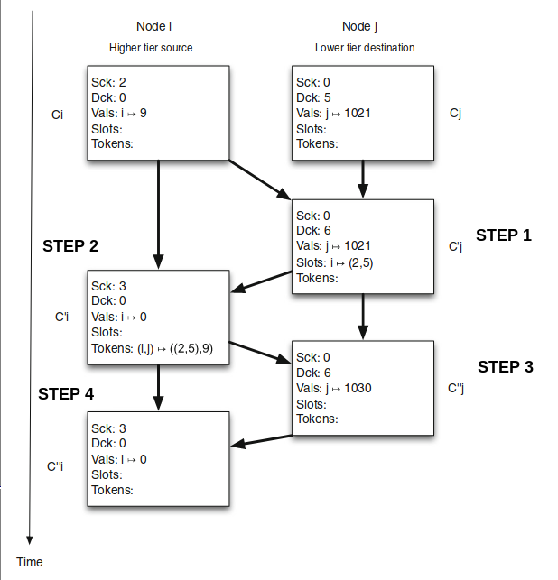

# Handoff Counters


This is yet another implementation for the Handoff Counters presented in the paper [Scalable Eventually Consistent Counters over Unreliable Networks](https://arxiv.org/abs/1307.3207). 
The official implementation can be found in [this](https://github.com/pssalmeida/handoff_counter-rs) repository. 

## Example 

Consider the following example, where `node i` sends its information to a `node j` in a lower tier. 




The following code shows the main operations performed in this example, separated in steps.

```rust
use std::collections::HashMap;
use HandoffCounter::Handoff;

fn setup() -> (Handoff<char>, Handoff<char>) {
    let mut ni: Handoff<char> = Handoff::new('A', 1, Some(2), Some(0));
    let mut nj: Handoff<char> = Handoff::new('B', 0, Some(0), Some(5));

    for _ in 0..9 {
        ni.inc();
    }

    for _ in 0..1021 {
        nj.inc();
    }
    return (ni, nj);
}

#[test]
fn step1() {
    let (ni, mut nj) = setup();

    // When
    nj.create_slot(&ni);
    let slots = nj.get_slots();

    // Then
    assert_eq!(HashMap::from([('A', (2, 5))]), slots);
    assert_eq!(6, nj.get_dck());    // Increment destination clock
}

#[test]
fn step2(){
    let (mut ni, mut nj) = setup();

    // When
    nj.create_slot(&ni);
    ni.create_token(&nj);

    //Then 
    assert_eq!(HashMap::from([(('A','B'), ((2,5),9))]), ni.get_tokens());   // Create token
    assert_eq!(3, ni.get_sck()); // Increment source clock
    assert_eq!(0, ni.get_self_vals());
}

#[test]
fn step3(){
    let (mut ni, mut nj) = setup();

    //When 
    nj.create_slot(&ni);
    ni.create_token(&nj);
    nj.fill_slots(&ni);

    //Then 
    assert_eq!(HashMap::new(), nj.get_slots()); // Empty slots
    assert_eq!(1030, nj.get_self_vals());       // Increments current vals[j]. 
}

#[test]
fn step4(){
    let (mut ni, mut nj) = setup();

    //When 
    nj.create_slot(&ni);
    ni.create_token(&nj);
    nj.fill_slots(&ni);
    ni.discard_tokens(&nj);

    //Then
    assert_eq!(HashMap::new(), ni.get_tokens());  
}

```

